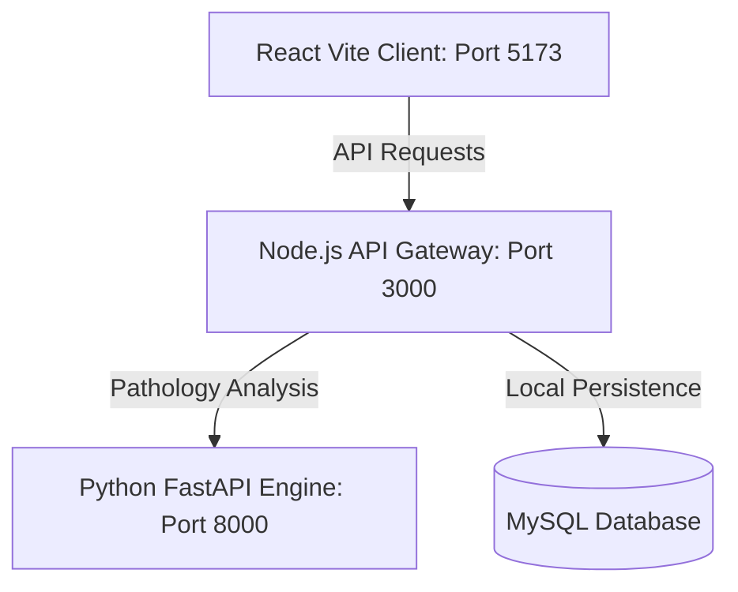

# 🔬 VitalsVision AI (VitaScan) | Secure Clinical Diagnostic Core

[](https://frontend-lake-nine-62.vercel.app)
[](https://fastapi.tiangolo.com/)
[](https://nodejs.org/)
[](https://vite.dev/)
[](https://www.docker.com/)

A secure full-stack clinical diagnostic portal integrating computer vision and acoustic signal processing to assist medical practitioners with real-time risk assessment. Built with a modular microservice architecture, VitalsVision AI leverages predictive digital-twin models to evaluate clinical parameters instantaneously.

🌐 **Live Application:** [https://frontend-lake-nine-62.vercel.app](https://frontend-lake-nine-62.vercel.app)

---

## 🔬 Core Diagnostic Modules

### 1. 👁️ HemaScan (Computer Vision Pathology Core)
*   **Utility:** Employs computer vision parameters to analyze lower eyelid mucosal pallor, providing practitioners with non-invasive, instant diagnostic indicators.
*   **Technological Architecture:** OpenCV image extraction scripts, custom color histogram threshold parameters, and real-time canvas overlays.

### 2. 🎙️ AudioTriage (Acoustic Respiratory Analysis Core)
*   **Utility:** Evaluates audio files containing patient cough recordings, analyzing frequency profiles and sound dynamics to assist in prioritizing urgent respiratory cases.
*   **Technological Architecture:** Audio signal processing pipelines mapping frequency spectrograms to categorize respiration risk levels.

### 3. 🤖 Contextual AI ReactiveBot & DigitalTwin UI
*   **Utility:** Provides active clinicians with a secure, real-time diagnostic dashboard featuring high-frequency vitals tracking, animated SVG Progress Rings, and a contextual AI Chat assistant.
*   **Technological Architecture:** React hooks state machine, responsive CSS glassmorphism widgets, and local AI API integration gateway fallback.

---

## 🏗️ System Microservice Architecture
The platform is designed around three completely decoupled, highly scalable service layers:



1.  **React Frontend:** High-frequency, buttery-smooth client interface showing live interactive telemetry charts and progress indicators.
2.  **Node.js API Gateway:** Acts as the traffic controller, handling routing, microservice authentication, headers normalization, and database transaction bridges.
3.  **Python FastAPI Engine:** High-performance analytical core executing all heavy computer vision, librosa audio calculations, and ML-model processing.

---

## 🚀 Deployment & Launch Protocols

### Option A: Automated Multi-Container Deployment (Docker Compose)
To compile and deploy the entire multi-service ecosystem (AI Engine, Node Gateway, React Frontend, and Database) in a single command:
```bash
docker-compose up --build
```

### Option B: Local Windows Manual Setup (Native Scripts)
If you prefer running services natively outside Docker:
1. Double-click the root automation file:
   ```cmd
   run_windows.bat
   ```
2. The script will automatically:
   * Create the Python virtual environment (`venv`) and install pip dependencies.
   * Pull and install all backend Node gateway dependencies.
   * Start the AI Engine, Node Gateway, and React Frontend in separate dedicated command windows.

---

## 🔒 Security & Performance Standards
*   **Hardened Gateway Routing:** Inter-service requests normalization to prevent direct database exposure.
*   **Docker Isolation:** Decoupled container runtime isolating Python WebGL calculations from frontend telemetry pipelines.
*   **Vite Module Partitioning:** Leverages rolling-bundle optimization to keep client load latency under sub-second speeds.
